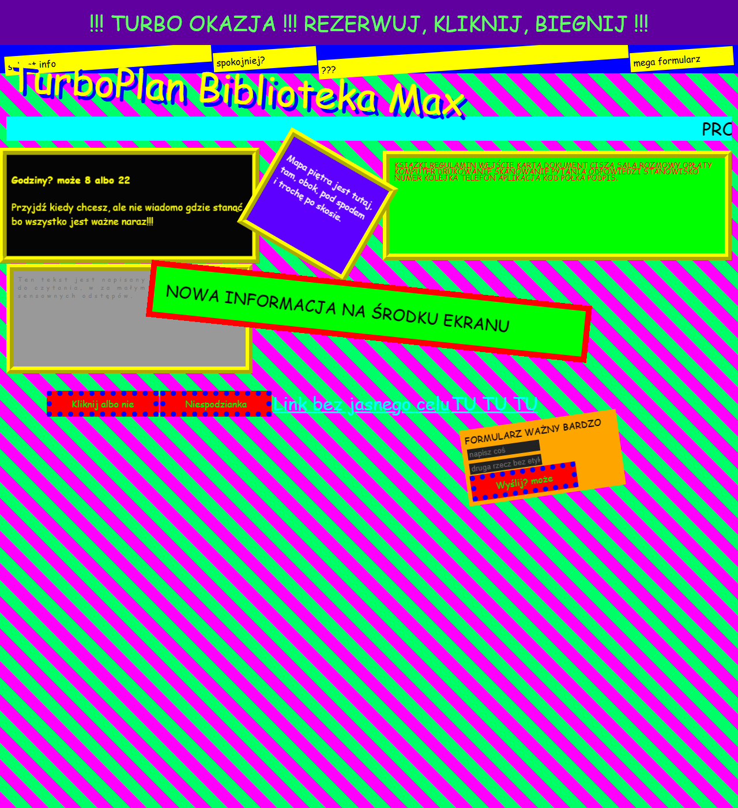

# Cicha Biblioteka i TurboPlan

Autor: Norbert Kowalski

Projekt zawiera dwie oryginalne koncepcje strony dla tej samej usługi:

- `friendly.html` - Cicha Biblioteka, spokojna i przewidywalna strona informacyjna.
- `bad.html` - TurboPlan, celowo chaotyczny panel z przykładami złych praktyk.

Dodatkowo:

- `index.html` - strona startowa z przejściem do obu koncepcji.
- `omowienie.html` - analiza zastosowanych i złamanych zasad.
- `friendly.png` i `bad.png` - zrzuty ekranu obu wersji.

## Zrzuty ekranu

## Hosting GitHub Pages

1. Utwórz repozytorium na GitHubie.
2. Wgraj pliki projektu do repozytorium.
3. Wejdź w Settings -> Pages.
4. Wybierz źródło: branch `main`, folder `/root`.
5. Po zapisaniu GitHub wygeneruje link w formacie:
   `https://twoj-login.github.io/nazwa-repozytorium/`

Przykładowe linki po opublikowaniu:

- Start: `https://twoj-login.github.io/nazwa-repozytorium/`
- Cicha Biblioteka: `https://twoj-login.github.io/nazwa-repozytorium/friendly.html`
- TurboPlan: `https://twoj-login.github.io/nazwa-repozytorium/bad.html`
- Analiza: `https://twoj-login.github.io/nazwa-repozytorium/omowienie.html`
